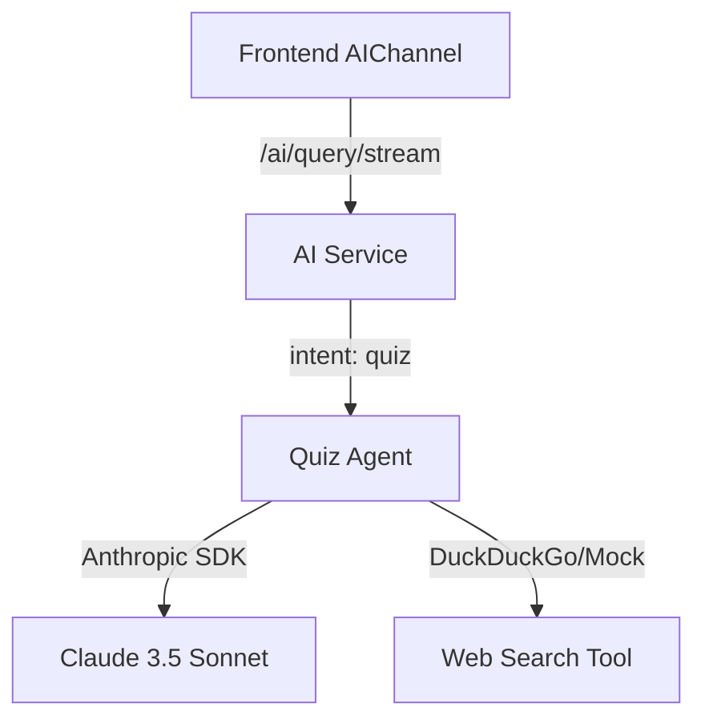

# Design: Anthropic SDK Integration & Quiz Logic

## Architecture Overview
The `ai-service` will be refactored to use the `anthropic` Python SDK. A new `QuizAgent` will be introduced to handle the complex multi-turn and tool-using logic required for the quiz.

### Component Diagram

## Detailed Design

### 1. Anthropic SDK Integration
- Update `requirements.txt` with `anthropic>=0.30.0`.
- Initialize `anthropic.AsyncAnthropic` in `orchestrator.py`.
- Use the Messages API for both streaming and non-streaming requests.

### 2. Quiz Logic
- **Predefined Parts[]**: The prompt will be structured using Anthropic's message content blocks, which map well to the user's request for "Parts[]".
- **3-Question Structure**: The system prompt will enforce a 3-question quiz format.
- **Sub-questions**: The agent will be instructed to ask follow-up questions based on user answers to deepen the interaction.

### 3. Web Search Tool
- Define an Anthropic tool `web_search(query: str)`.
- Implement the tool using a lightweight search library or a mock service if external access is restricted.
- Allow the agent to use this tool to find up-to-date information for the quiz content.

### 4. Data Flow
1. User selects "Quiz" in the frontend.
2. Frontend sends `intent: "quiz"` to `ai-service`.
3. `ai-service` invokes `QuizAgent`.
4. `QuizAgent` initiates a session with Claude, including the `web_search` tool definition.
5. Claude generates the first question (potentially after a web search).
6. Response is streamed back to the frontend.

## Trade-offs and Considerations
- **Rate Limiting**: Multi-turn quiz interactions consume more tokens and requests. The `AI_RATE_LIMIT_PER_HOUR` might need adjustment.
- **Context Persistence**: For a multi-turn quiz, we either need to send the full history back and forth or implement session management in `ai-service`. Initially, we'll keep it simple by having the frontend manage the interaction history for the session.
