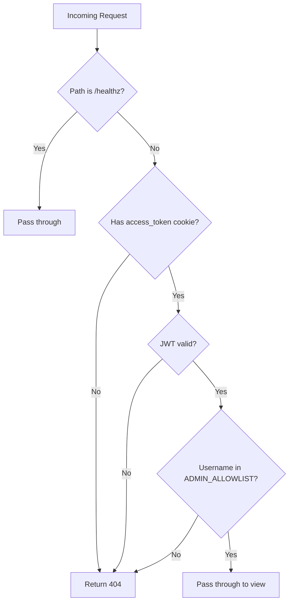
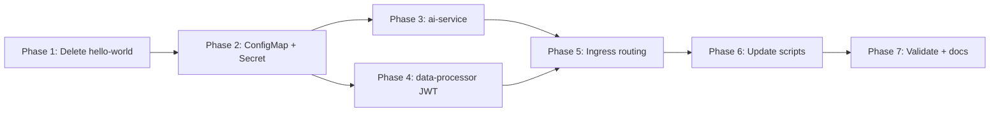

# Implementation Plan: K3s Strangler Cutover Blocker

**Source:** [`TO_CLAUDE.md`](TO_CLAUDE.md) | **OpenSpec:** [`openspec/changes/blocker-for-k3s/`](openspec/changes/blocker-for-k3s/proposal.md)

## Architecture Overview

```mermaid
graph TB
    Client[Browser Client]
    
    subgraph K3s Cluster - irc-app namespace
        Ingress[NGINX Ingress Controller]
        
        subgraph Core Ingress - no rewrite
            AuthRoute[/auth/* /channels/* /ws /health /]
            AIRoute[/ai/*]
        end
        
        subgraph DP Ingress - with rewrite
            DPRoute[/data-processor/* rewrite to /api/*]
        end
        
        Monolith[monolith:8002 - FastAPI]
        AIService[ai-service:8001 - FastAPI]
        DataProcessor[data-processor:8003 - Django]
        Redis[redis:6379]
        PostgreSQL[postgresql:5432]
        
        ConfigMap[irc-app-config - shared ConfigMap]
        Secret[irc-app-secret - K8s Secret]
    end
    
    Client --> Ingress
    Ingress --> AuthRoute
    Ingress --> AIRoute
    Ingress --> DPRoute
    AuthRoute --> Monolith
    AIRoute --> AIService
    DPRoute --> DataProcessor
    AIService --> Redis
    Monolith --> Redis
    Monolith --> PostgreSQL
    AIService -.->|JWT verify| Secret
    DataProcessor -.->|JWT verify| Secret
    Monolith -.->|JWT sign| Secret
```

## Confirmed Decisions from User

| Question | Decision |
|----------|----------|
| AI service logic | Extract real AI logic from monolith into standalone FastAPI |
| Data-processor JWT gating | Django middleware intercepting all requests except /healthz |
| Redis access | Same Redis pod in irc-app namespace |
| Hello-world | DELETE from repo entirely |
| AI service env vars | Shared ConfigMap for all services |
| SECRET_KEY management | Shared K8s Secret referenced by all services |

---

## Phase 1 — Delete Hello-World Stub

Remove all traces of the hello-world stub from the repository.

### Files to DELETE
- [`k8s/hello-world/Dockerfile`](k8s/hello-world/Dockerfile)
- [`k8s/hello-world/main.py`](k8s/hello-world/main.py)
- [`k8s/manifests/hello-world.yaml`](k8s/manifests/hello-world.yaml)

### Files to MODIFY

**[`k8s/scripts/05-deploy-monolith-hello.sh`](k8s/scripts/05-deploy-monolith-hello.sh)**
- Rename to `05-deploy-services.sh`
- Remove lines 28-30 (hello-world docker build)
- Remove lines 38-39 (hello-world docker save/import)
- Remove line 47 (kubectl apply hello-world.yaml)
- Remove lines 53-54 (kubectl wait hello-world)
- Remove lines 65-67 (hello-world test instructions)
- Add build/import/deploy steps for `ai-service` and `data-processor`

**[`k8s/scripts/06-configure-ingress.sh`](k8s/scripts/06-configure-ingress.sh)**
- Remove hello-world validation curls (lines 40-49)
- Replace with new routing validation tests for ai-service and data-processor

**[`k8s/scripts/restart-deployments.sh`](k8s/scripts/restart-deployments.sh)**
- Remove hello-world build (lines 27-28), import (lines 36-37), sed (line 46), apply (line 59), rollout (line 68), verify (lines 80-81)
- Add equivalent steps for ai-service and data-processor

**[`k8s/README.md`](k8s/README.md)**
- Remove all hello-world references from directory structure, validation, and strangler pattern sections

**[`run_locally_k3s.sh`](run_locally_k3s.sh)**
- Update step 7/7 message from "monolith and hello-world" to "monolith, ai-service, and data-processor"
- Update summary route table to show real services

---

## Phase 2 — Shared K8s ConfigMap and Secret

Create centralized configuration resources so all services share the same env vars and secrets.

### New Files

**`k8s/manifests/configmap.yaml`** — Shared non-sensitive config:
```yaml
apiVersion: v1
kind: ConfigMap
metadata:
  name: irc-app-config
  namespace: irc-app
data:
  ALGORITHM: HS256
  REDIS_URL: redis://redis:6379/0
  ALLOWED_ORIGINS: http://localhost,http://127.0.0.1
  AI_RATE_LIMIT_PER_HOUR: "10"
  ADMIN_ALLOWLIST: admina
  DATA_PROCESSOR_URL: http://data-processor:8003
  MEDIA_STORAGE_URL: http://media-storage:9101
  ANTHROPIC_API_BASE: https://api.anthropic.com
  CLAUDE_MODEL: claude-3-haiku-20240307
```

**`k8s/manifests/secret.yaml`** — Sensitive config:
```yaml
apiVersion: v1
kind: Secret
metadata:
  name: irc-app-secret
  namespace: irc-app
type: Opaque
stringData:
  SECRET_KEY: your-secret-key-here
  ANTHROPIC_API_KEY: ""
```

### Monolith Manifest Update

Update [`k8s/manifests/monolith.yaml`](k8s/manifests/monolith.yaml:30) to use `envFrom` referencing the ConfigMap and Secret instead of inline `env` blocks.

---

## Phase 3 — Create ai-service FastAPI Application

### New Directory: `ai-service/`

```
ai-service/
├── Dockerfile
├── requirements.txt
├── main.py
├── config.py
├── auth.py          # JWT cookie validation + admin allowlist
├── rate_limiter.py  # Redis-backed rate limiting
├── orchestrator.py  # Agent orchestrator extracted from monolith
```

### Key Design Decisions

**JWT cookie validation flow** — mirrors [`backend/src/api/endpoints/auth.py:90-119`](backend/src/api/endpoints/auth.py:90):
1. Read `access_token` cookie from request
2. Strip `Bearer ` prefix if present
3. Decode with `SECRET_KEY` + `HS256`
4. Extract `sub` claim as username
5. Check username against `ADMIN_ALLOWLIST` (semicolon-separated, case-insensitive)
6. Return HTTP 404 if not admin (matching [`backend/src/core/admin.py:52-53`](backend/src/core/admin.py:52) behavior)

**Rate limiting** — extracted from [`backend/src/services/rate_limiter.py`](backend/src/services/rate_limiter.py):
- Redis key: `rate:{user_id}:ai`
- Window: 3600s
- Max: configurable via `AI_RATE_LIMIT_PER_HOUR`

**Endpoints:**

| Endpoint | Method | Auth | Description |
|----------|--------|------|-------------|
| `/healthz` | GET | None | K8s probe, returns 200 |
| `/ai/query` | POST | Admin | AI query with intent routing |
| `/ai/query/stream` | POST | Admin | SSE streaming AI response |
| `/ai/status` | GET | Admin | Rate limit status + AI availability |

**Dependencies** (`requirements.txt`):
```
fastapi==0.104.1
uvicorn[standard]==0.24.0
python-jose[cryptography]==3.3.0
redis==5.0.1
httpx>=0.27.0
pydantic==2.5.2
pydantic-settings==2.1.0
```

**Dockerfile** — based on [`backend/Dockerfile`](backend/Dockerfile) pattern:
- `python:3.12-slim`
- Expose port 8001
- CMD: `uvicorn main:app --host 0.0.0.0 --port 8001`

### K8s Manifest: `k8s/manifests/ai-service.yaml`

```yaml
# Deployment + Service
# Port: 8001
# Probes: /healthz
# envFrom: irc-app-config ConfigMap + irc-app-secret Secret
# imagePullPolicy: Never (local K3s)
# Resources: 128Mi/256Mi memory, 100m/500m CPU
```

---

## Phase 4 — Data-Processor JWT Gating + K3s Manifest

### Modifications to `data-processor/`

**[`data-processor/requirements.txt`](data-processor/requirements.txt)** — add:
```
python-jose[cryptography]==3.3.0
```

**New file: `data-processor/middleware/jwt_auth.py`** — Django middleware:



- Reads `SECRET_KEY` and `ALGORITHM` from environment
- Reads `ADMIN_ALLOWLIST` from environment 
- Skips `/healthz` path (ungated for K8s probes)
- Returns HTTP 404 for non-admin (not 401/403 — security through obscurity)

**[`data-processor/config/settings.py`](data-processor/config/settings.py)** — add:
```python
# JWT shared secret (same as monolith)
JWT_SECRET_KEY = os.getenv("SECRET_KEY", "your-secret-key-here")
JWT_ALGORITHM = os.getenv("ALGORITHM", "HS256")
ADMIN_ALLOWLIST = os.getenv("ADMIN_ALLOWLIST", "admina")

MIDDLEWARE = [
    "middleware.jwt_auth.AdminAllowlistMiddleware",  # ADD before other middleware
    "corsheaders.middleware.CorsMiddleware",
    ...
]
```

**New file: `data-processor/api/healthz.py`** — ungated health probe:
```python
# Simple /healthz endpoint returning 200 OK for K8s probes
# Separate from /api/health which is behind JWT gating
```

**[`data-processor/config/urls.py`](data-processor/config/urls.py)** — add `/healthz` route

### K8s Manifest: `k8s/manifests/data-processor.yaml`

```yaml
# Deployment + Service
# Port: 8003
# Probes: /healthz (ungated)
# envFrom: irc-app-config ConfigMap + irc-app-secret Secret
# imagePullPolicy: Never (local K3s)
# Resources: 256Mi/512Mi memory (heavier due to OpenCV/Tesseract), 100m/500m CPU
```

---

## Phase 5 — Ingress Routing Fix

Replace the single [`k8s/manifests/ingress.yaml`](k8s/manifests/ingress.yaml) with two ingress resources to avoid rewrite collisions.

### Core Ingress (no rewrite)

```yaml
apiVersion: networking.k8s.io/v1
kind: Ingress
metadata:
  name: irc-app-core-ingress
  namespace: irc-app
spec:
  ingressClassName: nginx
  rules:
    - http:
        paths:
          - path: /auth
            pathType: Prefix
            backend: monolith:8002
          - path: /channels
            pathType: Prefix
            backend: monolith:8002
          - path: /ws
            pathType: Prefix
            backend: monolith:8002
          - path: /health
            pathType: Prefix
            backend: monolith:8002
          - path: /ai
            pathType: Prefix
            backend: ai-service:8001
          - path: /
            pathType: Prefix
            backend: monolith:8002
```

### Data-Processor Ingress (with regex rewrite)

```yaml
apiVersion: networking.k8s.io/v1
kind: Ingress
metadata:
  name: irc-app-dp-ingress
  namespace: irc-app
  annotations:
    nginx.ingress.kubernetes.io/rewrite-target: /api/$1
    nginx.ingress.kubernetes.io/use-regex: "true"
spec:
  ingressClassName: nginx
  rules:
    - http:
        paths:
          - path: /data-processor/(.*)
            pathType: ImplementationSpecific
            backend: data-processor:8003
```

### Routing Table

| Client Path | Ingress | Backend Service | Backend Path |
|-------------|---------|-----------------|--------------|
| `/auth/*` | core | monolith:8002 | `/auth/*` |
| `/channels/*` | core | monolith:8002 | `/channels/*` |
| `/ws` | core | monolith:8002 | `/ws` |
| `/health` | core | monolith:8002 | `/health` |
| `/ai/*` | core | ai-service:8001 | `/ai/*` |
| `/data-processor/*` | dp | data-processor:8003 | `/api/*` |
| `/*` | core | monolith:8002 | `/*` |

---

## Phase 6 — Update K3s Deployment Scripts

### [`k8s/scripts/05-deploy-services.sh`](k8s/scripts/05-deploy-monolith-hello.sh) (renamed)

Build flow:
1. Build `irc-monolith:latest` from `backend/`
2. Build `ai-service:latest` from `ai-service/`
3. Build `data-processor:latest` from `data-processor/`
4. Import all 3 into K3s via `k3s ctr images import`
5. Apply ConfigMap + Secret manifests
6. Apply monolith, ai-service, data-processor manifests
7. Wait for all 3 deployments to be ready

### [`k8s/scripts/06-configure-ingress.sh`](k8s/scripts/06-configure-ingress.sh)

New validation tests:
1. `curl http://localhost/health` → monolith 200
2. `curl http://localhost/ai/status` → 404 (non-admin)
3. `curl http://localhost/data-processor/health` → 404 (non-admin)

### [`k8s/scripts/restart-deployments.sh`](k8s/scripts/restart-deployments.sh)

- Build/tag/import: monolith, ai-service, data-processor (remove hello-world)
- Sed update manifests: monolith.yaml, ai-service.yaml, data-processor.yaml
- Apply and rollout all services
- Verify all pod images

### [`run_locally_k3s.sh`](run_locally_k3s.sh)

- Step count stays at 7 (or adjust)
- Step 7 builds monolith + ai-service + data-processor
- Summary shows real service routes

---

## Phase 7 — Validation Checklist

Per [`TO_CLAUDE.md`](TO_CLAUDE.md:47) Phase 5:

```bash
# 1. Pod status
kubectl get pods -n irc-app
# Expected: monolith, ai-service, data-processor, redis, postgresql

# 2. Monolith health
curl http://localhost/health
# Expected: 200

# 3. AI status (non-admin)
curl http://localhost/ai/status
# Expected: 404

# 4. Data-processor health (non-admin)
curl http://localhost/data-processor/health
# Expected: 404

# 5. No hello-world references
rg -n "hello-world" .
# Expected: no results

# 6. Admin path checks (after login as admina)
# /ai/* returns 200
# /data-processor/* returns 200
```

---

## File Change Summary

| Action | File | Phase |
|--------|------|-------|
| DELETE | `k8s/hello-world/` (directory) | 1 |
| DELETE | `k8s/manifests/hello-world.yaml` | 1 |
| CREATE | `k8s/manifests/configmap.yaml` | 2 |
| CREATE | `k8s/manifests/secret.yaml` | 2 |
| MODIFY | `k8s/manifests/monolith.yaml` | 2 |
| CREATE | `ai-service/Dockerfile` | 3 |
| CREATE | `ai-service/requirements.txt` | 3 |
| CREATE | `ai-service/main.py` | 3 |
| CREATE | `ai-service/config.py` | 3 |
| CREATE | `ai-service/auth.py` | 3 |
| CREATE | `ai-service/rate_limiter.py` | 3 |
| CREATE | `ai-service/orchestrator.py` | 3 |
| CREATE | `k8s/manifests/ai-service.yaml` | 3 |
| MODIFY | `data-processor/requirements.txt` | 4 |
| CREATE | `data-processor/middleware/__init__.py` | 4 |
| CREATE | `data-processor/middleware/jwt_auth.py` | 4 |
| CREATE | `data-processor/api/healthz.py` | 4 |
| MODIFY | `data-processor/config/settings.py` | 4 |
| MODIFY | `data-processor/config/urls.py` | 4 |
| CREATE | `k8s/manifests/data-processor.yaml` | 4 |
| MODIFY | `k8s/manifests/ingress.yaml` | 5 |
| RENAME | `k8s/scripts/05-deploy-monolith-hello.sh` → `05-deploy-services.sh` | 6 |
| MODIFY | `k8s/scripts/06-configure-ingress.sh` | 6 |
| MODIFY | `k8s/scripts/restart-deployments.sh` | 6 |
| MODIFY | `run_locally_k3s.sh` | 6 |
| MODIFY | `k8s/README.md` | 7 |
| MODIFY | `openspec/changes/blocker-for-k3s/tasks.md` | 7 |

**Total: 10 new files, 12 modified files, 3 deleted files/directories**

---

## Execution Order

Phases must execute in order (1 → 7). Within each phase, tasks can be parallelized where noted. Phase 1 is a clean prerequisite for all other phases. Phase 2 must complete before Phases 3-4 since manifests reference the ConfigMap/Secret. Phases 3 and 4 can execute in parallel. Phase 5 depends on 3+4 being complete. Phase 6 depends on 5. Phase 7 is final validation.


