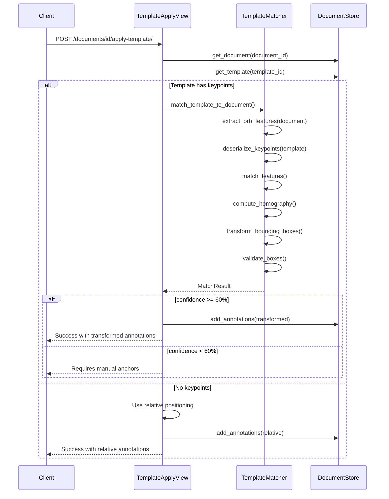

# Task 4: Template Matching Service - Implementation Plan

## Overview

Task 4 implements the template matching service for the data-processor microservice. This service enables intelligent template application to new documents by detecting visual similarities between a template's source document and target documents, then transforming annotation bounding boxes accordingly.

## Requirements from Design Document

From [`design.md`](../openspec/changes/add-data-processor-channel/design.md:157-172), the D4 decision specifies:

### Algorithm: ORB + RANSAC Homography

1. **Extract ORB keypoints** from template and target images
2. **Match descriptors** using BFMatcher with Hamming distance
3. **Apply ratio test** (Lowe's ratio = 0.75) to filter ambiguous matches
4. **Compute homography matrix** using RANSAC
5. **Transform template bounding boxes** to target coordinates
6. **Validate transformed boxes** (area ratio, aspect ratio checks)

### Fallback Strategy

- If feature matching confidence < 60%, prompt user for manual anchor point selection

## Existing Infrastructure to Leverage

### From [`storage/in_memory.py`](../data-processor/storage/in_memory.py)

- `Template` dataclass with `feature_keypoints: Optional[bytes]` field for storing serialized ORB keypoints
- `TemplateLabel` with relative coordinates (`relative_x`, `relative_y`, `relative_width`, `relative_height`)
- `BoundingBox` dataclass for annotation coordinates

### From [`services/preprocessor.py`](../data-processor/services/preprocessor.py)

- `load_image_from_bytes()` - Load image from bytes to OpenCV format
- `convert_to_grayscale()` - Convert to grayscale for feature detection

### From [`services/ocr_pipeline.py`](../data-processor/services/ocr_pipeline.py)

- Pattern for OpenCV image processing
- `BoundingBox` coordinate handling

### From [`api/views.py`](../data-processor/api/views.py:408-477)

- `TemplateApplyView` already exists but uses simple relative positioning
- Needs enhancement to use feature-based matching when keypoints are available

## Implementation Architecture

```
┌─────────────────────────────────────────────────────────────────────┐
│                    Template Matching Flow                            │
└─────────────────────────────────────────────────────────────────────┘

┌──────────────┐     ┌───────────────────┐     ┌──────────────────────┐
│  Template    │     │ TemplateMatcher   │     │    Target Document   │
│  (stored)    │────▶│                   │◀────│    (new upload)      │
└──────────────┘     └───────────────────┘     └──────────────────────┘
       │                      │                          │
       ▼                      ▼                          ▼
┌──────────────┐     ┌───────────────────┐     ┌──────────────────────┐
│ Keypoints    │     │ 1. Extract ORB    │     │ Keypoints extracted  │
│ (cached)     │     │ 2. BFMatcher      │     │ on-the-fly           │
└──────────────┘     │ 3. Ratio test     │     └──────────────────────┘
                     │ 4. RANSAC homo    │
                     │ 5. Transform bbox │
                     └───────────────────┘
                              │
                              ▼
                     ┌───────────────────┐
                     │  MatchResult      │
                     │  - confidence     │
                     │  - transformed_   │
                     │    bounding_boxes │
                     │  - homography_mat │
                     │  - inlier_count   │
                     └───────────────────┘
```

## File Structure

```
data-processor/
└── services/
    └── template_matcher.py  (NEW)
        ├── TemplateMatchConfig - Configuration dataclass
        ├── MatchResult - Result dataclass
        ├── extract_orb_features() - ORB keypoint extraction
        ├── serialize_keypoints() - Keypoint serialization
        ├── deserialize_keypoints() - Keypoint deserialization
        ├── match_features() - BFMatcher with ratio test
        ├── compute_homography() - RANSAC homography
        ├── transform_bounding_box() - Perspective transformation
        ├── validate_transformed_box() - Area/aspect validation
        ├── match_template_to_document() - Main entry point
        └── TemplateMatcher - Class wrapper
```

## Detailed Component Design

### 1. Configuration Dataclass

```python
@dataclass
class TemplateMatchConfig:
    # ORB parameters
    orb_nfeatures: int = 500
    orb_scale_factor: float = 1.2
    orb_nlevels: int = 8

    # Matching parameters
    ratio_threshold: float = 0.75  # Lowe's ratio test
    min_match_count: int = 10

    # RANSAC parameters
    ransac_reproj_threshold: float = 5.0

    # Confidence thresholds
    min_confidence: float = 0.6  # Fallback trigger

    # Validation parameters
    max_area_ratio: float = 2.0  # Max change in bounding box area
    max_aspect_change: float = 0.5  # Max change in aspect ratio
```

### 2. MatchResult Dataclass

```python
@dataclass
class MatchResult:
    success: bool
    confidence: float
    transformed_boxes: List[BoundingBox]
    homography_matrix: Optional[np.ndarray]
    inlier_count: int
    total_matches: int
    error_message: Optional[str] = None
    requires_manual_anchors: bool = False
```

### 3. Core Functions

#### extract_orb_features()

```python
def extract_orb_features(
    image: np.ndarray,
    config: TemplateMatchConfig
) -> Tuple[List[cv2.KeyPoint], np.ndarray]:
    """Extract ORB keypoints and descriptors from image."""
```

#### match_features()

```python
def match_features(
    descriptors1: np.ndarray,
    descriptors2: np.ndarray,
    config: TemplateMatchConfig
) -> List[cv2.DMatch]:
    """Match descriptors using BFMatcher with Lowe's ratio test."""
```

#### compute_homography()

```python
def compute_homography(
    keypoints1: List[cv2.KeyPoint],
    keypoints2: List[cv2.KeyPoint],
    matches: List[cv2.DMatch],
    config: TemplateMatchConfig
) -> Tuple[Optional[np.ndarray], int]:
    """Compute homography matrix using RANSAC."""
```

#### transform_bounding_box()

```python
def transform_bounding_box(
    bbox: BoundingBox,
    homography: np.ndarray
) -> BoundingBox:
    """Transform bounding box using homography matrix."""
```

### 4. Keypoint Serialization

Since `Template.feature_keypoints` stores bytes, we need pickle-based serialization:

```python
def serialize_keypoints(
    keypoints: List[cv2.KeyPoint],
    descriptors: np.ndarray
) -> bytes:
    """Serialize keypoints and descriptors for storage."""

def deserialize_keypoints(
    data: bytes
) -> Tuple[List[cv2.KeyPoint], np.ndarray]:
    """Deserialize keypoints and descriptors from storage."""
```

### 5. Main Entry Point

```python
def match_template_to_document(
    template: Template,
    document_image: np.ndarray,
    config: Optional[TemplateMatchConfig] = None
) -> MatchResult:
    """
    Match a template to a document image and transform annotations.

    1. Load/extract template keypoints
    2. Extract document keypoints
    3. Match features
    4. Compute homography if enough matches
    5. Transform template labels to document coordinates
    6. Validate transformed boxes
    """
```

## Integration Points

### API Views Enhancement

Update [`TemplateApplyView`](../data-processor/api/views.py:408-477) to:

1. Check if template has stored keypoints
2. If yes, use feature matching for precise alignment
3. If no, fall back to current relative positioning
4. Return match confidence and validation results

### Serializer Updates

Add to [`TemplateApplySerializer`](../data-processor/api/serializers.py:224-230):

```python
class TemplateMatchResultSerializer(serializers.Serializer):
    """Serializer for template matching results."""
    success = serializers.BooleanField()
    confidence = serializers.FloatField()
    inlier_count = serializers.IntegerField()
    total_matches = serializers.IntegerField()
    requires_manual_anchors = serializers.BooleanField()
    error_message = serializers.CharField(allow_null=True)
```

### Template Creation Update

When creating a template from a document, extract and store ORB keypoints:

```python
# In TemplateListCreateView.post()
if source_document_id:
    document = store.get_document(source_document_id)
    if document and document.image_data:
        image = load_image_from_bytes(document.image_data)
        keypoints, descriptors = extract_orb_features(image)
        template.feature_keypoints = serialize_keypoints(keypoints, descriptors)
```

## Data Flow Diagram



## Error Handling

1. **No keypoints stored**: Fall back to relative positioning
2. **Too few matches**: Return `requires_manual_anchors = True`
3. **Homography fails**: Return error with details
4. **Invalid transformed boxes**: Mark individual boxes as invalid
5. **Image loading fails**: Return 400 error

## Testing Strategy

### Unit Tests

1. `test_extract_orb_features`: Verify keypoint extraction
2. `test_serialize_deserialize_keypoints`: Roundtrip test
3. `test_match_features`: Test with known similar images
4. `test_compute_homography`: Test with synthetic point sets
5. `test_transform_bounding_box`: Test coordinate transformation
6. `test_validate_transformed_box`: Test validation rules

### Integration Tests

1. Test full matching flow with sample document pair
2. Test fallback to relative positioning
3. Test low-confidence handling

## Success Criteria

- [ ] ORB features can be extracted and stored for templates
- [ ] Feature matching works with >60% confidence on similar documents
- [ ] Bounding boxes are correctly transformed via homography
- [ ] Low-confidence matches trigger fallback strategy
- [ ] API returns match confidence and validation results
- [ ] Existing relative positioning still works for templates without keypoints

## Next Steps After Task 4

Once Task 4 is complete, the following tasks can proceed:

- **Task 6**: FastAPI Backend Integration (adds `data_processor` channel type)
- **Task 9**: Template Management UI (needs matching results display)
- **Task 13**: Testing (needs template matching tests)
