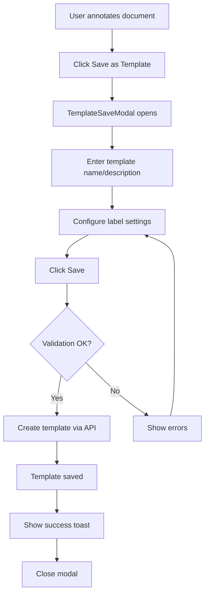
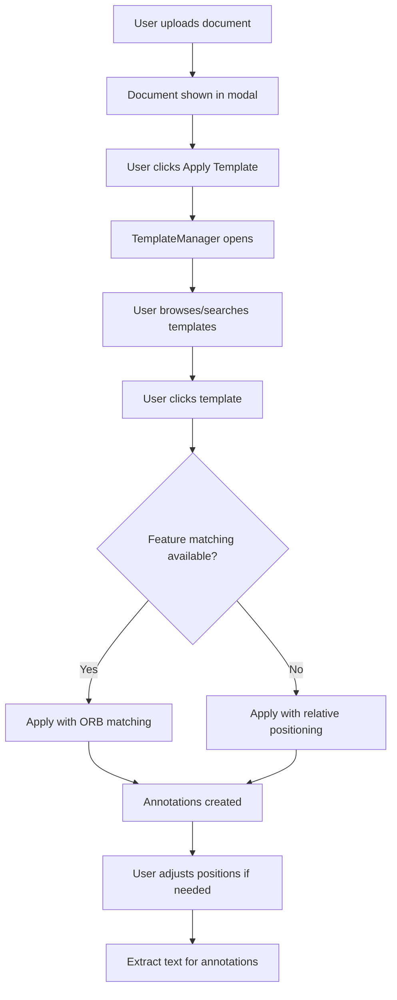

# Section 9: Template Management UI - Implementation Plan

## Overview

This plan details the implementation of the Template Management UI for the data-processor channel feature. The Template Management UI allows users to create, view, edit, and delete annotation templates that can be reused across documents.

## Current State Analysis

### Existing Template Infrastructure

**Backend - Data Processor Service:**

- [`storage/in_memory.py`](../data-processor/storage/in_memory.py:209) - `Template` and `TemplateLabel` dataclasses with full CRUD support via `DocumentStore`
- [`api/views.py`](../data-processor/api/views.py:314) - `TemplateListCreateView` and `TemplateDetailView` REST endpoints
- [`api/serializers.py`](../data-processor/api/serializers.py:171) - `TemplateSerializer` and `TemplateLabelSerializer`
- Templates are scoped to channels via `channel_id` and track `created_by` user

**Backend - FastAPI Proxy:**

- [`data_processor.py`](../backend/src/api/endpoints/data_processor.py:463) - Proxy endpoints for templates with user authentication

**Frontend:**

- [`types/index.ts`](../frontend/src/types/index.ts:196) - `Template` and `TemplateLabel` TypeScript types
- [`api/dataProcessor.ts`](../frontend/src/api/dataProcessor.ts:225) - `listTemplates`, `createTemplate`, `getTemplate`, `deleteTemplate`, `applyTemplate` API functions
- [`AnnotationToolbar.tsx`](../frontend/src/components/AnnotationToolbar.tsx:178) - Basic template list in sidebar with apply functionality

### Template Data Structure

```typescript
type Template = {
  id: string;
  channel_id: string;
  created_by: string;
  name: string;
  description: string;
  thumbnail_url?: string | null;
  version: number;
  is_active: boolean;
  labels: TemplateLabel[];
  created_at: string;
};

type TemplateLabel = {
  id: string;
  label_type: LabelType; // header, table, signature, date, amount, custom
  label_name: string;
  color: string;
  relative_x: number; // 0.0-1.0 relative to image width
  relative_y: number;
  relative_width: number;
  relative_height: number;
  expected_format?: string | null; // regex for validation
  is_required: boolean;
};
```

## Architecture Decision

### Template Access Approach

**Decision: Keep templates accessible from within DataProcessorChannel via modal dialog**

**Rationale:**

- Templates are channel-scoped per design decision in [`design.md`](../openspec/changes/add-data-processor-channel/design.md:515)
- Users work with templates in context of document annotation workflow
- Avoid navigation complexity by keeping template management inline
- Consistent with existing modal patterns for document annotation

**Alternative Considered:**

- Dedicated `/templates` route - Rejected because templates are channel-specific and lack global context

### Storage Strategy

**Decision: Maintain in-memory storage for MVP**

Per [`design.md`](../openspec/changes/add-data-processor-channel/design.md:174) Decision D5:

- Templates stored in `DocumentStore` singleton in data-processor service
- Data persists across requests but is lost on service restart
- Clear interfaces designed for future database migration
- Templates associated with `created_by` user ID from authenticated request

## Component Architecture

```
                    DataProcessorChannel
                           │
        ┌──────────────────┼──────────────────┐
        │                  │                  │
        ▼                  ▼                  ▼
DocumentAnnotationModal  TemplateManager    DocumentList
        │                  │
        │                  │
        ▼                  ▼
AnnotationToolbar    TemplateSaveModal
    templates list
```

### New Components

#### 1. TemplateManager.tsx

**Purpose:** Full template management interface accessible from DataProcessorChannel

**Location:** `frontend/src/components/TemplateManager.tsx`

**Features:**

- Grid/list view of channel templates
- Search and filter templates
- Preview template structure
- Edit and delete templates
- One-click apply to selected document

**Props:**

```typescript
interface TemplateManagerProps {
  channelId: number | string;
  isOpen: boolean;
  onClose: () => void;
  onApplyTemplate?: (templateId: string) => void;
  selectedDocumentId?: string;
}
```

#### 2. TemplateSaveModal.tsx

**Purpose:** Modal for creating new templates or editing existing ones

**Location:** `frontend/src/components/TemplateSaveModal.tsx`

**Features:**

- Template name and description input
- Label configuration editor
- Color picker for each label
- Label type selector
- Regex pattern input for validation
- Required field toggle
- Preview generated labels

**Props:**

```typescript
interface TemplateSaveModalProps {
  isOpen: boolean;
  onClose: () => void;
  onSave: (template: CreateTemplateRequest) => Promise<void>;
  channelId: number | string;
  existingTemplate?: Template; // For edit mode
  sourceDocumentId?: string; // To extract ORB keypoints
  initialLabels?: TemplateLabelInput[]; // From current annotations
}
```

#### 3. TemplatePreview.tsx

**Purpose:** Thumbnail preview component showing template label layout

**Location:** `frontend/src/components/TemplatePreview.tsx`

**Features:**

- Visual representation of label positions
- Color-coded label indicators
- Label count badge
- Hover tooltip with label names

**Props:**

```typescript
interface TemplatePreviewProps {
  template: Template;
  size?: "small" | "medium" | "large";
  onClick?: () => void;
  selected?: boolean;
}
```

## API Enhancements

### Existing Endpoints - Sufficient for MVP

| Endpoint                                         | Method | Purpose                    | Status    |
| ------------------------------------------------ | ------ | -------------------------- | --------- |
| `/data-processor/templates/`                     | GET    | List templates by channel  | ✅ Exists |
| `/data-processor/templates/`                     | POST   | Create template            | ✅ Exists |
| `/data-processor/templates/{id}`                 | GET    | Get template details       | ✅ Exists |
| `/data-processor/templates/{id}`                 | DELETE | Delete template            | ✅ Exists |
| `/data-processor/documents/{id}/apply-template/` | POST   | Apply template to document | ✅ Exists |

### API Client Updates Needed

Add template update function to [`dataProcessor.ts`](../frontend/src/api/dataProcessor.ts):

```typescript
export type UpdateTemplateRequest = {
  name?: string;
  description?: string;
  labels?: TemplateLabelInput[];
  is_active?: boolean;
};

export const updateTemplate = async (
  templateId: string,
  updates: UpdateTemplateRequest,
): Promise<Template> => {
  const response = await fetch(
    `${DATA_PROCESSOR_URL}/templates/${templateId}`,
    {
      method: "PUT",
      headers: { "Content-Type": "application/json" },
      credentials: "include",
      body: JSON.stringify(updates),
    },
  );

  if (!response.ok) {
    const error = await response
      .json()
      .catch(() => ({ detail: "Update failed" }));
    throw new Error(error.detail || "Update failed");
  }

  return response.json();
};
```

## UI/UX Design

### Template Creation Workflow



### Template Application Workflow



### TemplateManager UI Layout

```
┌──────────────────────────────────────────────────────────────┐
│ Templates                                            [✕]     │
├──────────────────────────────────────────────────────────────┤
│ [🔍 Search templates...                        ] [+ New]     │
├──────────────────────────────────────────────────────────────┤
│                                                              │
│  ┌─────────────┐  ┌─────────────┐  ┌─────────────┐           │
│  │ [preview]   │  │ [preview]   │  │ [preview]   │           │
│  │             │  │             │  │             │           │
│  │ Invoice     │  │ Receipt     │  │ Contract    │           │
│  │ 5 labels    │  │ 3 labels    │  │ 8 labels    │           │
│  │ v2          │  │ v1          │  │ v1          │           │
│  └─────────────┘  └─────────────┘  └─────────────┘           │
│                                                              │
│  ┌─────────────┐  ┌─────────────┐                            │
│  │ [preview]   │  │ [preview]   │                            │
│  │             │  │             │                            │
│  │ ID Card     │  │ Form A1     │                            │
│  │ 4 labels    │  │ 6 labels    │                            │
│  │ v1          │  │ v3          │                            │
│  └─────────────┘  └─────────────┘                            │
│                                                              │
├──────────────────────────────────────────────────────────────┤
│ Selected: Invoice v2                                         │
│ [Apply to Document]  [Edit]  [Delete]                        │
└──────────────────────────────────────────────────────────────┘
```

### TemplateSaveModal UI Layout

```
┌──────────────────────────────────────────────────────────────┐
│ Save Template                                        [✕]     │
├──────────────────────────────────────────────────────────────┤
│ Template Name *                                              │
│ [Invoice Template                                    ]       │
│                                                              │
│ Description                                                  │
│ [Standard invoice with header, line items, and total   ]     │
│ [                                                      ]     │
│                                                              │
├──────────────────────────────────────────────────────────────┤
│ Labels (5)                                                   │
│                                                              │
│ ┌────────────────────────────────────────────────────────┐   │
│ │ 1. Invoice Number                                      │   │
│ │    Type: [header ▾]  Color: [■ #3B82F6]  Required: [✓] │   │
│ │    Format: [INV-\d{4}-\d{3}                        ]   │   │
│ └────────────────────────────────────────────────────────┘   │
│ ┌────────────────────────────────────────────────────────┐   │
│ │ 2. Date                                                │   │
│ │    Type: [date ▾]    Color: [■ #F59E0B]  Required: [✓] │   │
│ │    Format: [\d{2}/\d{2}/\d{4}                      ]   │   │
│ └────────────────────────────────────────────────────────┘   │
│ ┌────────────────────────────────────────────────────────┐   │
│ │ 3. Total Amount                                        │   │
│ │    Type: [amount ▾]  Color: [■ #EF4444]  Required: [✓] │   │
│ │    Format: [\$[\d,]+\.\d{2}                        ]   │   │
│ └────────────────────────────────────────────────────────┘   │
│ ...                                                          │
│                                                              │
├──────────────────────────────────────────────────────────────┤
│                              [Cancel]  [Save Template]       │
└──────────────────────────────────────────────────────────────┘
```

## Implementation Tasks

### 9.1 Create TemplateManager.tsx

- [ ] Create component file with props interface
- [ ] Implement template grid view with cards
- [ ] Add search input with filtering
- [ ] Add template selection state
- [ ] Implement Apply, Edit, Delete actions
- [ ] Add loading and empty states
- [ ] Integrate with TanStack Query for data fetching

### 9.2 Create TemplateSaveModal.tsx

- [ ] Create modal component structure
- [ ] Add template name and description inputs
- [ ] Create label configuration list
- [ ] Add label type dropdown selector
- [ ] Add color picker for each label
- [ ] Add regex format input
- [ ] Add required checkbox toggle
- [ ] Implement form validation
- [ ] Add save/cancel actions
- [ ] Support edit mode with existing template

### 9.3 Implement Template Preview Thumbnails

- [ ] Create TemplatePreview component
- [ ] Render label positions as colored rectangles
- [ ] Scale positions to thumbnail size
- [ ] Add label count badge
- [ ] Add hover state with template info

### 9.4 One-Click Template Application

- [ ] Add Apply button to AnnotationToolbar template list
- [ ] Show loading state during template application
- [ ] Display confidence score after matching
- [ ] Highlight low-confidence annotations
- [ ] Add visual feedback for successful application

### 9.5 Integrate with DataProcessorChannel

- [ ] Add Manage Templates button to channel header
- [ ] Wire up TemplateManager modal state
- [ ] Pass selected document ID for template application
- [ ] Add Save as Template button to DocumentAnnotationModal
- [ ] Wire up TemplateSaveModal with current annotations

### 9.6 Add API Client Function

- [ ] Add `updateTemplate` function to dataProcessor.ts
- [ ] Add TypeScript types for update request

## Hooks for State Management

### useTemplates.ts

```typescript
// frontend/src/hooks/useTemplates.ts
import { useQuery, useMutation, useQueryClient } from "@tanstack/react-query";
import {
  listTemplates,
  createTemplate,
  updateTemplate,
  deleteTemplate,
  applyTemplate,
} from "../api/dataProcessor";

export function useTemplates(channelId: string | number | undefined) {
  return useQuery({
    queryKey: ["templates", channelId],
    queryFn: () => listTemplates(channelId),
    enabled: !!channelId,
  });
}

export function useCreateTemplate() {
  const queryClient = useQueryClient();
  return useMutation({
    mutationFn: createTemplate,
    onSuccess: (_, variables) => {
      queryClient.invalidateQueries({
        queryKey: ["templates", variables.channel_id],
      });
    },
  });
}

export function useUpdateTemplate() {
  const queryClient = useQueryClient();
  return useMutation({
    mutationFn: ({
      templateId,
      updates,
    }: {
      templateId: string;
      updates: UpdateTemplateRequest;
    }) => updateTemplate(templateId, updates),
    onSuccess: () => {
      queryClient.invalidateQueries({ queryKey: ["templates"] });
    },
  });
}

export function useDeleteTemplate() {
  const queryClient = useQueryClient();
  return useMutation({
    mutationFn: deleteTemplate,
    onSuccess: () => {
      queryClient.invalidateQueries({ queryKey: ["templates"] });
    },
  });
}

export function useApplyTemplate() {
  const queryClient = useQueryClient();
  return useMutation({
    mutationFn: ({
      documentId,
      request,
    }: {
      documentId: string;
      request: ApplyTemplateRequest;
    }) => applyTemplate(documentId, request),
    onSuccess: (_, variables) => {
      queryClient.invalidateQueries({
        queryKey: ["document", variables.documentId],
      });
    },
  });
}
```

## Color Palette for Label Types

Reuse existing colors from [`AnnotationToolbar.tsx`](../frontend/src/components/AnnotationToolbar.tsx:29):

| Label Type | Color  | Hex Code  |
| ---------- | ------ | --------- |
| Header     | Blue   | `#3B82F6` |
| Table      | Green  | `#10B981` |
| Signature  | Purple | `#8B5CF6` |
| Date       | Amber  | `#F59E0B` |
| Amount     | Red    | `#EF4444` |
| Custom     | Gray   | `#6B7280` |

## Testing Considerations

1. **Unit Tests:**
   - TemplateManager rendering and interactions
   - TemplateSaveModal form validation
   - TemplatePreview label positioning

2. **Integration Tests:**
   - Create template → appears in list
   - Apply template → creates annotations
   - Delete template → removed from list

3. **E2E Tests:**
   - Full workflow: Annotate → Save Template → Apply to New Document

## Open Questions

1. **Should templates support thumbnail images from source documents?**
   - Current implementation has `thumbnail_url` field but no upload mechanism
   - Consider generating thumbnail from source document annotations

2. **Should we add template categories or tags for organization?**
   - Current scope: Simple list with search
   - Future: Categories like Invoice, Receipt, Contract, etc.

3. **Should template application show side-by-side comparison?**
   - Current: Apply directly to document
   - Future: Preview overlay before confirming

## Summary

This implementation plan provides a comprehensive approach to building the Template Management UI. The design:

- Leverages existing API infrastructure
- Maintains channel-scoped template access
- Provides intuitive workflows for creation and application
- Uses familiar modal patterns consistent with the application
- Supports future migration to persistent storage

Switch to Code mode to begin implementation of the components.
